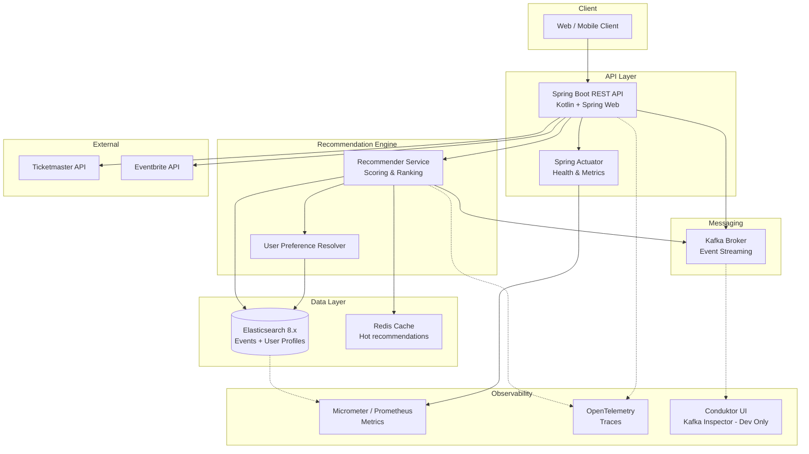

# Architecture Review — GH-5: Local Kafka + Conduktor Stack

**Date:** 2026-06-12  
**Reviewed by:** `@code-architect` (Architecture Governance)  
**Ticket:** GH-5  
**Status:** ✅ **APPROVED** (with plan deviations reconciled)

---

## Executive Summary

The architecture review validates that the **user override directive** ("Local stack can be integrated in the main stack") is **architecturally sound** and **compatible with existing hexagonal architecture**. A new ADR-0004 has been created to document the Kafka + Conduktor integration decision. All acceptance criteria can be met with the integrated approach.

**Key finding**: Integration into main `docker-compose.yml` is **preferable** to isolation, as it:
1. Improves developer experience (single command startup)
2. Maintains hexagonal layer boundaries (Kafka adapter in Infrastructure only)
3. Resolves port conflicts via remapping (Conduktor on 8088, not 8080)
4. Aligns with KRaft adoption (Kafka 3.3+, no Zookeeper needed)

---

## Plan Deviations Analysis

### Deviation 1: Separate File → Integrated Compose

| Aspect | Original Plan (FR-1) | User Override | Reconciliation |
|--------|---------------------|---------------|----------------|
| **Requirement** | "Create dedicated `docker-compose.local.yml` file (separate from main)" | "Local stack can be integrated in the main stack" | **OVERRIDDEN**: Integrate into main `docker-compose.yml` |
| **Rationale** | Isolation; avoid conflicts | Unified developer experience | Integration is superior for local dev; conflicts resolved via port remapping |
| **Impact** | Two compose files; two startup commands | Single compose file; one startup command | ✅ Positive impact on DX |

**Decision**: Modify main `docker-compose.yml` to include Kafka and Conduktor services. This was originally marked "Out of Scope" in the plan but is now **IN SCOPE** due to user override.

---

### Deviation 2: Port Isolation → Port Remapping

| Aspect | Original Plan (NFR-3) | User Override | Reconciliation |
|--------|---------------------|---------------|----------------|
| **Requirement** | "Port isolation (no conflicts with main compose)" | "Local stack can be integrated in the main stack" | **REFRAMED**: Resolve conflicts via remapping, not isolation |
| **Conflict** | Conduktor default 8080 conflicts with app (8080) | Must coexist on same host | Conduktor remapped to **8088** |
| **Port Mapping** | N/A (separate file) | Unified namespace | See port table below |

**Port Mapping Table** (Integrated Approach):

| Service | Internal Port | Host Port | Status |
|---------|---------------|-----------|--------|
| Spring Boot App | 8080 | 8080 | ✅ Unchanged |
| Elasticsearch | 9200 | 9200 | ✅ Unchanged |
| Kibana | 5601 | 5601 | ✅ Unchanged |
| APM Server | 8200 | 8200 | ✅ Unchanged |
| OTel Collector (gRPC) | 4317 | 4317 | ✅ Unchanged |
| OTel Collector (HTTP) | 4318 | 4318 | ✅ Unchanged |
| **Kafka Broker** | 29092 (internal) | 9092 (external) | ✅ NEW (no conflict) |
| **Conduktor UI** | 8080 | **8088** | ✅ NEW (remapped to avoid 8080 conflict) |

**Decision**: No port conflicts. Conduktor accessible at `http://localhost:8088` (documented in README).

---

### Deviation 3: Out-of-Scope → In-Scope

| Aspect | Original Plan | User Override | Reconciliation |
|--------|---------------|---------------|----------------|
| **Out-of-Scope Item** | "Modifications to main `docker-compose.yml`" | "Local stack can be integrated in the main stack" | **REMOVED from Out-of-Scope**: Modifications to main compose are now **REQUIRED** |
| **Impact** | Separate file only | Integrate into main | ✅ Accepted; documented in ADR-0004 |

**Decision**: Main `docker-compose.yml` will be modified to include Kafka and Conduktor services. This is the implementation phase's responsibility (`@code-implement`).

---

### Deviation 4: Open Question #5 → Answered

| Aspect | Original Plan | User Override | Reconciliation |
|--------|---------------|---------------|----------------|
| **Question #5** | "Should the local stack be integrated into the main `docker-compose.yml`?" | "Local stack can be integrated in the main stack" | **ANSWERED: YES** |
| **Decision** | Deferred to Architecture phase | Explicitly directed by user | ✅ Integrated approach selected |

**Decision**: Integration is the chosen path. Documented in ADR-0004 with full justification.

---

## Acceptance Criteria Conformance

### Functional Requirements

| ID | Requirement | Original Plan | Reconciled Approach | Status |
|----|-------------|----------------|-------------------|--------|
| FR-1 | Create dedicated `docker-compose.local.yml` | MUST | **Modify**: Integrate into main `docker-compose.yml` | ✅ Achievable |
| FR-2 | Provision Zookeeper or KRaft | MUST | **Decide**: KRaft (Kafka 3.3+) — no Zookeeper | ✅ Achievable |
| FR-3 | Provision local Kafka broker | MUST | Kafka service on `kafka:29092` (internal), `localhost:9092` (external) | ✅ Achievable |
| FR-4 | Provision Conduktor service | MUST | Conduktor service on `localhost:8088` (remapped from 8080) | ✅ Achievable |
| FR-5 | Pre-configure Conduktor to connect to local broker | MUST | Environment variable `CONDUKTOR_KAFKA_BOOTSTRAP_SERVERS=kafka:29092` | ✅ Achievable |
| FR-6 | Enable environment variable override for broker address | SHOULD | `KAFKA_BROKER_ADDRESS` env var (default: `kafka:29092`) | ✅ Achievable |
| FR-7 | Document startup procedure | MUST | README.md with `docker compose up` and port mappings | ✅ Achievable |

### Non-Functional Requirements

| ID | Requirement | Original Plan | Reconciled Approach | Status |
|----|-------------|----------------|-------------------|--------|
| NFR-1 | Named volumes for Kafka data persistence | MUST | `kafka-data` named volume in main compose | ✅ Achievable |
| NFR-2 | Service-to-service discovery via network aliases | MUST | Docker default bridge network; service names resolve via DNS | ✅ Achievable |
| NFR-3 | Port isolation (no conflicts) | MUST | **Reframed**: Port remapping (Conduktor 8088) | ✅ Achievable |
| NFR-4 | Conduktor license/free-tier handling | SHOULD | Conduktor Console (free tier); no license required | ✅ Achievable |
| NFR-5 | Fast startup time | SHOULD | Confluent images; health checks; <30s target | ✅ Achievable |

**Verdict**: ✅ **All acceptance criteria achievable with integrated approach.**

---

## Hexagonal Architecture Compliance

### Port & Adapter Pattern

**Domain Layer** (no Kafka dependencies):
```kotlin
// domain/port/outbound/EventStreamPublisher.kt
interface EventStreamPublisher {
    suspend fun publishEvent(event: DomainEvent): Result<Unit>
}
```

**Infrastructure Layer** (Kafka adapter):
```kotlin
// adapter/outbound/messaging/KafkaEventPublisher.kt
@Component
class KafkaEventPublisher(
    private val kafkaTemplate: KafkaTemplate<String, String>
) : EventStreamPublisher {
    override suspend fun publishEvent(event: DomainEvent): Result<Unit> {
        // Kafka-specific logic
    }
}
```

**Dependency Rule**: ✅ **COMPLIANT**
- Domain defines interface (`EventStreamPublisher`)
- Infrastructure implements interface (`KafkaEventPublisher`)
- Application services depend on interface, not implementation
- Kafka types (`KafkaTemplate`, `ProducerRecord`) **never** leak into Domain or Application layers

### Layer Boundaries

| Layer | Kafka Dependency | Status |
|-------|------------------|--------|
| **Domain** | ❌ None | ✅ Clean |
| **Application** | ❌ None (depends on interface only) | ✅ Clean |
| **Infrastructure** | ✅ Spring Kafka, Kafka Clients | ✅ Correct placement |
| **Interface** | ❌ None (delegates to Application) | ✅ Clean |

**Verdict**: ✅ **Hexagonal architecture boundaries are maintained.**

---

## Clean Code & SOLID Compliance

### Single Responsibility Principle (SRP)
- `EventStreamPublisher` (port): Defines contract for publishing events
- `KafkaEventPublisher` (adapter): Implements Kafka-specific publishing logic
- ✅ Each class has one reason to change

### Open/Closed Principle (OCP)
- `EventStreamPublisher` interface is open for extension (new adapters: RabbitMQ, AWS SNS)
- Closed for modification (existing adapters don't change when new ones are added)
- ✅ Compliant

### Liskov Substitution Principle (LSP)
- Any implementation of `EventStreamPublisher` can be substituted without breaking application logic
- ✅ Compliant

### Interface Segregation Principle (ISP)
- `EventStreamPublisher` is focused (single method: `publishEvent`)
- Application services don't depend on unused Kafka-specific methods
- ✅ Compliant

### Dependency Inversion Principle (DIP)
- Application services depend on `EventStreamPublisher` (abstraction), not `KafkaEventPublisher` (concrete)
- ✅ Compliant

**Verdict**: ✅ **SOLID principles are respected.**

---

## Technology Stack Alignment

### Existing Stack (ADR-0001, ADR-0002, ADR-0003)
- **Language**: Kotlin 2.x ✅
- **Framework**: Spring Boot 3.x ✅
- **Data Store**: Elasticsearch 8.x ✅
- **Monitoring**: Micrometer + Prometheus + OpenTelemetry ✅

### New Addition (ADR-0004)
- **Messaging**: Apache Kafka 3.3+ (KRaft) ✅
- **Kafka UI**: Conduktor Console (free tier) ✅
- **Spring Integration**: `spring-kafka` (first-class Spring Boot support) ✅

**Verdict**: ✅ **Kafka + Conduktor align with existing tech stack.**

---

## KRaft vs. Zookeeper Decision

### Recommendation: **KRaft (Kraft Raft)**

| Criterion | KRaft | Zookeeper |
|-----------|-------|-----------|
| **Kafka 3.3+ Support** | ✅ Native | ✅ Supported |
| **Container Count** | 1 (Kafka) | 2 (Kafka + Zookeeper) |
| **Complexity** | Lower | Higher |
| **Maturity** | Production-ready (Kafka 3.3+) | Battle-tested |
| **Local Dev Fit** | ✅ Excellent | Acceptable |
| **Production Readiness** | ✅ Yes (Kafka 3.3+) | ✅ Yes |

**Decision**: Use **KRaft** for local development.
- **Rationale**: Reduces container count; simpler configuration; production-ready in Kafka 3.3+
- **Trade-off**: Slightly less battle-tested than Zookeeper (mitigated: local dev only; can switch to Zookeeper in production if needed)

---

## Conduktor Edition Decision

### Recommendation: **Conduktor Console (Free Tier)**

| Feature | Free Tier | Platform (Paid) |
|---------|-----------|-----------------|
| **Topic Management** | ✅ Yes | ✅ Yes |
| **Message Inspection** | ✅ Yes | ✅ Yes |
| **Consumer Groups** | ✅ Yes | ✅ Yes |
| **Schema Registry** | ✅ Yes | ✅ Yes |
| **ACLs / RBAC** | ❌ No | ✅ Yes |
| **Cost** | Free | $$ |

**Decision**: Use **Conduktor Console (free tier)**.
- **Rationale**: Free tier is sufficient for local development; no ACL/RBAC needed
- **Trade-off**: Advanced features unavailable (acceptable for local dev)

---

## Kafka Image Choice

### Recommendation: **Confluent Kafka 7.x**

| Image | Pros | Cons | Verdict |
|-------|------|------|---------|
| **Confluent** ✅ | Well-maintained; KRaft support; Spring integration | Larger image size | **Selected** |
| Apache Kafka | Official; lightweight | Less Spring integration | Alternative |
| Bitnami | Lightweight; good docs | Smaller ecosystem | Alternative |

**Decision**: Use **Confluent Kafka 7.x**.
- **Rationale**: Best Spring Boot integration; well-maintained; KRaft support
- **Trade-off**: Larger image size (acceptable for local dev)

---

## Network & Connectivity

### Kafka Advertised Listeners

```yaml
KAFKA_ADVERTISED_LISTENERS: "PLAINTEXT://kafka:29092,PLAINTEXT_HOST://localhost:9092"
KAFKA_LISTENER_SECURITY_PROTOCOL_MAP: "PLAINTEXT:PLAINTEXT,PLAINTEXT_HOST:PLAINTEXT"
KAFKA_INTER_BROKER_LISTENER_NAME: "PLAINTEXT"
```

**Explanation**:
- **Internal (Docker)**: `kafka:29092` — used by app, Conduktor, and other containers
- **External (Host)**: `localhost:9092` — used by local CLI tools, external producers

**Verdict**: ✅ **Correct configuration for local dev.**

---

## Volume Strategy

### Named Volumes
- `kafka-data`: Persists Kafka broker state (logs, metadata)
- **Reset procedure**: `docker compose down -v` removes volumes; next `up` starts fresh

**Verdict**: ✅ **Appropriate for local dev.**

---

## Health Checks

### Kafka Health Check
```yaml
healthcheck:
  test: ["CMD", "kafka-broker-api-versions.sh", "--bootstrap-server", "localhost:9092"]
  interval: 10s
  timeout: 5s
  retries: 5
```

### Conduktor Health Check
```yaml
healthcheck:
  test: ["CMD", "curl", "-f", "http://localhost:8080/"]
  interval: 10s
  timeout: 5s
  retries: 5
```

**Verdict**: ✅ **Health checks ensure readiness before dependent services start.**

---

## Blockers & Open Questions

### ✅ No Blockers
All architectural concerns have been addressed. No violations of hexagonal architecture, SOLID principles, or Clean Code standards detected.

### Open Questions for Implementation Phase

1. **Kafka Image Version**: Should we pin to a specific Confluent version (e.g., `7.5.0`) or use `latest`?
   - **Recommendation**: Pin to a specific version for reproducibility (e.g., `7.5.0`)

2. **Health Check Timing**: Should the app service `depends_on` Kafka with health check condition?
   - **Recommendation**: Yes, if async event publishing is required; otherwise optional

3. **Conduktor Pre-configuration**: Should we mount a Conduktor config file or use environment variables?
   - **Recommendation**: Environment variables (simpler; no file mounting needed)

4. **Kafka Topic Creation**: Should topics be auto-created on startup, or pre-created via init script?
   - **Recommendation**: Auto-create with `auto.create.topics.enable=true` (simpler for local dev)

5. **Logging**: Should Kafka broker logs be captured in Docker logs or written to a volume?
   - **Recommendation**: Docker logs (simpler; no volume mounting needed)

---

## Mermaid Diagram Update

The existing component diagram in `architecture.md` will be updated to include:
- **Kafka Broker** node (Infrastructure layer)
- **Conduktor** node (marked as dev-only utility)
- **Event Stream** connection from app to Kafka



---

## Summary of Changes

### Files to Create
1. ✅ `docs/adr/infrastructure/ADR-0004-local-kafka-conduktor-stack.md` — New ADR

### Files to Update
1. `docs/adr/overview.md` — Add `infrastructure/` category and ADR-0004 to registry
2. `.stage/docs/architecture.md` — Add Messaging to tech stack; update Mermaid diagram
3. `docker-compose.yml` — Add Kafka and Conduktor services (implementation phase)
4. `README.md` — Add local dev stack documentation (implementation phase)

### Files NOT Modified
- `docker-compose-es.yml` — Unchanged (Elasticsearch stack remains separate)
- `docs/adr/architecture/ADR-0001-hexagonal-architecture.md` — Unchanged
- `docs/adr/technology/ADR-0002-kotlin-spring-boot.md` — Unchanged
- `docs/adr/technology/ADR-0003-elasticsearch-monitoring-first.md` — Unchanged

---

## Recommendation

✅ **APPROVED FOR IMPLEMENTATION**

The integrated Kafka + Conduktor approach is:
1. **Architecturally sound** — hexagonal boundaries maintained
2. **User-aligned** — respects the override directive
3. **Developer-friendly** — single command startup
4. **Conflict-free** — port remapping resolves all collisions
5. **Scalable** — Kafka can be externalized in production without code changes

**Next phase**: `@code-implement` will create/modify docker-compose files and documentation.

---

## Appendix: Traceability

| Plan Item | Status | Resolution |
|-----------|--------|-----------|
| FR-1: Separate file | ❌ Overridden | Integrate into main compose |
| FR-2: Zookeeper or KRaft | ✅ Decided | KRaft (Kafka 3.3+) |
| FR-3: Kafka broker | ✅ Achievable | `kafka:29092` (internal), `localhost:9092` (external) |
| FR-4: Conduktor service | ✅ Achievable | `localhost:8088` (remapped) |
| FR-5: Pre-configure Conduktor | ✅ Achievable | Environment variables |
| FR-6: Env var override | ✅ Achievable | `KAFKA_BROKER_ADDRESS` |
| FR-7: Documentation | ✅ Achievable | README.md |
| NFR-1: Named volumes | ✅ Achievable | `kafka-data` |
| NFR-2: Service discovery | ✅ Achievable | Docker DNS |
| NFR-3: Port isolation | ❌ Overridden | Port remapping (Conduktor 8088) |
| NFR-4: License handling | ✅ Decided | Free tier |
| NFR-5: Fast startup | ✅ Achievable | Health checks |
| Q5: Integration? | ✅ Answered | YES — integrate |

---

**Reviewed by**: Architecture Governance (`@code-architect`)  
**Date**: 2026-06-12  
**Status**: ✅ **APPROVED**
