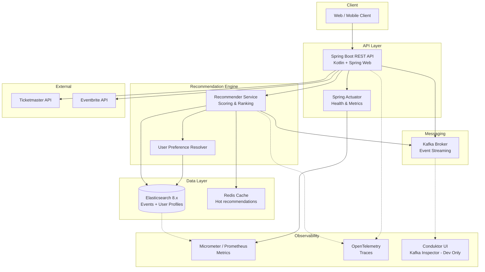

# event_recommender — System Architecture

**Date:** 2026-05-25
**Owner:** @code-architect
**Status:** Active

---

## System Overview

`event_recommender` is a Kotlin/Spring Boot REST API that recommends events (concerts, conferences, meetups, sports) to users based on their preference profiles and attendance history. Elasticsearch serves as the primary search and data store, chosen for its full-text search, geo-filtering, and native vector similarity capabilities needed for semantic recommendation.

---

## Component Diagram



---

## Tech Stack

| Concern | Technology | ADR |
|---------|-----------|-----|
| Language | Kotlin 2.x | ADR-0001 |
| Runtime | JVM 21 | ADR-0001 |
| Framework | Spring Boot 3.x | ADR-0001 |
| Build | Gradle (Kotlin DSL) | ADR-0001 |
| Search / Data | Elasticsearch 8.x | ADR-0002 |
| Monitoring | Micrometer + Prometheus + Actuator | ADR-0002 |
| Tracing | OpenTelemetry (OTLP) | ADR-0002 |
| Messaging | Apache Kafka 3.3+ (KRaft) | ADR-0004 |
| Kafka UI | Conduktor Console (free tier) — dev only | ADR-0004 |
| Cache | Redis (future — not yet implemented) | TBD |
| Auth | JWT / Spring Security (future) | TBD |

---

## Module Structure

```
src/
  main/kotlin/com/eventrecommender/
    EventRecommenderApplication.kt   ← Spring Boot entry point
    api/                             ← HTTP route handlers + request/response schemas
    recommender/                     ← Recommendation algorithms and scoring
    data/                            ← Elasticsearch repositories + domain models
    integrations/                    ← External API clients (Ticketmaster, Eventbrite)
    workers/                         ← Background jobs (pre-compute recommendations)
    config/                          ← Spring configuration classes
    monitoring/                      ← Custom Micrometer metrics + health indicators
  main/resources/
    application.yml
  test/kotlin/com/eventrecommender/
    ...
```

---

## Local Dev Stack

The integrated `docker-compose.yml` includes the complete local development environment:

| Service | Port | Purpose |
|---------|------|---------|
| **Spring Boot App** | 8080 | REST API server |
| **Elasticsearch** | 9200 | Search and data store |
| **Kibana** | 5601 | Elasticsearch UI and monitoring |
| **Kafka Broker** | 9092 (external), 29092 (internal) | Event streaming |
| **Conduktor** | 8088 | Kafka topic inspection and debugging |
| **APM Server** | 8200 | Application Performance Monitoring |
| **OTel Collector** | 4317/4318 | OpenTelemetry trace collection |

**Startup**: `docker compose up` boots all services with health checks and service discovery.

**Kafka Configuration**:
- **Mode**: KRaft (no Zookeeper)
- **Image**: Confluent Kafka 7.x
- **Internal DNS**: `kafka:29092` (used by app and containers)
- **External Access**: `localhost:9092` (used by CLI tools)
- **Data Persistence**: Named volume `kafka-data`

See [ADR-0004](../../docs/adr/infrastructure/ADR-0004-local-kafka-conduktor-stack.md) for detailed design decisions.

---

## Key Constraints

- **Monitoring-first**: Elasticsearch monitoring is set up before domain logic — all ES operations emit metrics from day one
- **Immutability**: data classes, `val` by default, no mutation of shared state
- **No persistence layer before search layer**: Elasticsearch is the primary store; no relational DB initially
- **Security**: all endpoints require auth except `/actuator/health` and `/actuator/prometheus`
- **Performance target**: recommendation response <200ms at p95

---

## Build & Run

```bash
./gradlew build          # compile + test
./gradlew bootRun        # start dev server (port 8080)
./gradlew test           # run test suite
```
