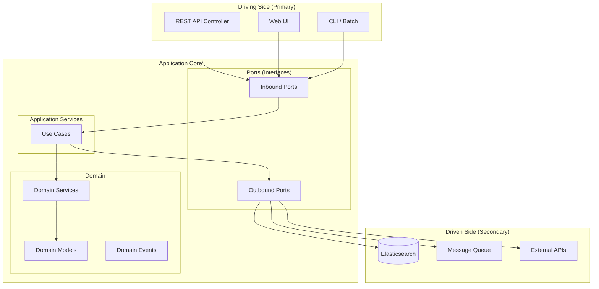

# Architecture Decision Records (ADRs)

## Organization

ADRs are organized by category into subdirectories:

```
docs/adr/
├── overview.md              ← you are here
├── architecture/            ← Architecture patterns & structural decisions
│   └── ADR-0001-*
├── technology/              ← Tech stack, frameworks, data stores
│   ├── ADR-0002-*
│   └── ADR-0003-*
└── infrastructure/          ← Deployment, local dev, messaging, CI/CD
    └── ADR-0004-*
```

## Categories

| Category | Path | Description |
|----------|------|-------------|
| **Architecture** | `architecture/` | Foundational patterns, layer structure, design principles |
| **Technology** | `technology/` | Language, framework, database, and tooling choices |
| **Infrastructure** | `infrastructure/` | Deployment, local dev environment, messaging, CI/CD decisions |

> Future categories can be added as needed (e.g., `security/` for auth decisions).

---

## ADR Registry

All ADRs use a **unified 4-digit sequential numbering** (`ADR-NNNN`) regardless of category.

| ID | Title | Category | Status |
|----|-------|----------|--------|
| [ADR-0001](architecture/ADR-0001-hexagonal-architecture.md) | Hexagonal Architecture as Base Pattern | Architecture | ✅ Accepted |
| [ADR-0002](technology/ADR-0002-kotlin-spring-boot.md) | Kotlin + Spring Boot 4 + JVM 21 as Backend Stack | Technology | ✅ Accepted |
| [ADR-0003](technology/ADR-0003-elasticsearch-monitoring-first.md) | Elasticsearch 8.x with Monitoring-First Approach | Technology | ✅ Accepted |
| [ADR-0004](infrastructure/ADR-0004-local-kafka-conduktor-stack.md) | Local Kafka + Conduktor Stack (Integrated into Main Docker Compose) | Infrastructure | ✅ Accepted |

---

## Architecture Overview: Hexagonal (Clean Onion) Architecture

### Core Principle

The event_recommender application follows **Hexagonal Architecture** (Ports & Adapters / Clean Architecture / Onion Architecture) to ensure a clear separation between business logic and technical infrastructure.



### Layers

#### 1. Domain (Core)
- **Domain Models**: Entities and Value Objects
- **Domain Services**: Business logic that does not belong to a single entity
- **Domain Events**: Events triggered by domain changes

#### 2. Application Services (Use Cases)
- Orchestrate Domain Services
- Implement Inbound Ports
- Use Outbound Ports for external communication
- Transaction management

#### 3. Ports (Interfaces)
- **Inbound Ports**: Interfaces the application exposes to the outside
- **Outbound Ports**: Interfaces the application requires from the infrastructure

#### 4. Adapters (Implementations)
- **Driving Adapters** (Primary): REST Controller, UI, CLI
- **Driven Adapters** (Secondary): Elasticsearch Repositories, Message Broker, External API Clients

### Rules

1. **Dependency Rule**: Dependencies always point inward (Adapter → Port → Domain)
2. **Domain has no external dependencies**: No Spring, no JPA, no HTTP in the domain core
3. **Ports are Interfaces**: The domain defines interfaces, adapters implement them
4. **Testability**: Domain and Application Services are testable without infrastructure

---

## Conventions

- **Numbering**: Global sequential 4-digit (`ADR-0001`, `ADR-0002`, …)
- **File naming**: `ADR-NNNN-short-slug.md`
- **Status values**: `proposed` → `accepted` → `deprecated` / `superseded`
- **New ADR template**: Copy an existing one and increment the number
